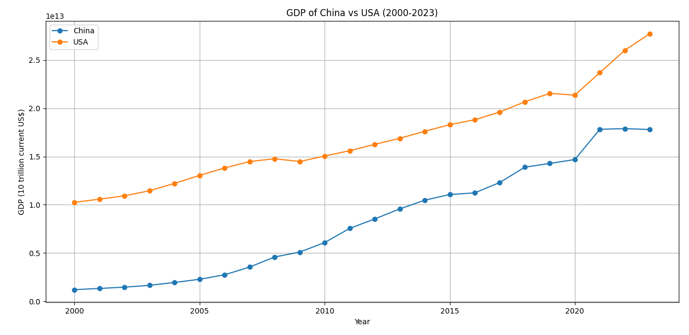
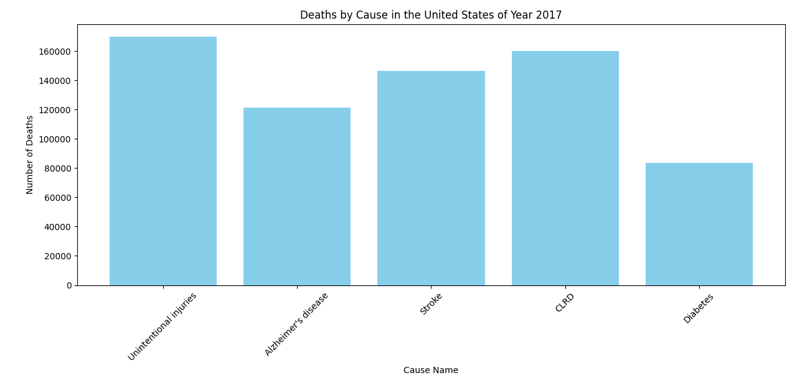

# Visualizing Datasets

## Plot 1: US vs. China GDP (2000-2023)

This line graph is generated based on the datasets from [awesome-json-datasets](https://github.com/jdorfman/awesome-json-datasets) under the subtitle "GDP". 
Both datasets are json files, which provide United State and China's GDP value of each year in US dollars. 

## Plot 2: Causes of Deaths in United States (2017)

This bar graph is generated based on the dataset from [data.gov](https://catalog.data.gov/dataset/?res_format=JSON&res_format=CSV&page=2).
The file name is "NCHS - Leading Causes of Death: United States", and I generate the graph based on the CSV file. I only selected numbers of deaths in year 2017 and a few causes of death. Not all causes are included. 

This project is created under the instruction of course [cmc-csci040 project_02](https://github.com/mikeizbicki/cmc-csci040/tree/2025spring/project_02_visualizing_datasets).

